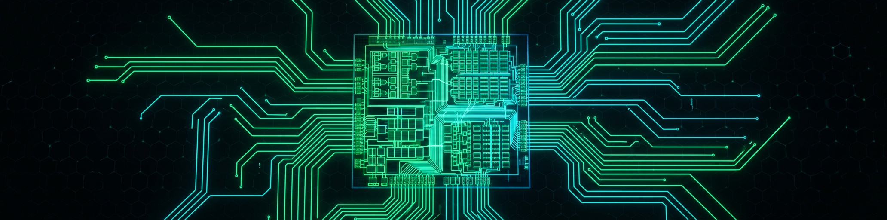

<!-- ============================================================
     GITHUB PROFILE README — Akif Mohamed J
     VLSI Physical Design · RTL-to-GDSII · PCB · Embedded · Edge AI
     ============================================================ -->

 

 

 

---

## 👨‍💻 About Me

> *"From RTL to GDSII — I design, verify, and sign off silicon that's ready for the foundry."*

Hi, I'm **Akif Mohamed J** — an **Electronics & Communication Engineer** specializing in **VLSI Physical Design**, **Analog IC Design**, **High-Speed PCB Design**, and **Embedded Systems**.

🎓 **B.E. Electronics & Communication Engineering** — Government College of Engineering, Srirangam
📍 Based in **Chennai, Tamil Nadu, India**

- 🧬 **Tapeout-clean physical design** — full RTL→GDSII flows on **SkyWater Sky130** with **OpenLane 2**
- 🔐 Designed an **AES-128 hardware crypto accelerator SoC** end-to-end
- ⚡ Built **6-layer high-speed Edge-AI PCBs** (ARM Cortex-M7, CAN-FD, RS-485, Gigabit Ethernet)
- 📐 Comfortable with **analog layout & simulation** in Cadence Virtuoso + SPICE
- 🚀 Always exploring **FPGA**, **Edge AI**, and next-gen semiconductor tooling

---

## 🧠 Technical Expertise

### 🧮 Languages & HDL

  
  
  
  
  
  
  
  
  

### 🏭 VLSI Physical Design & EDA

  
  
  
  
  
  
  
  
  

### 🛠 PCB & Hardware Design

  
  
  
  
  
  
  
  
  

### 🤖 Edge AI & Tooling

  
  
  
  
  

---

## 🚀 Featured Projects

### 🔐 [AES-Crypto-SoC](https://github.com/akifmohamed/AES-Crypto-SoC)
**AES-128 Hardware Crypto Accelerator SoC — RTL-to-GDSII**
Full hardware implementation of the AES-128 cipher as a dedicated crypto accelerator, taken through the complete physical-design flow:
`Verilog RTL → Yosys synthesis → OpenSTA timing → OpenLane 2 P&R → Cadence Virtuoso layout → GDSII`

### 🧮 [PipeCore-GDS](https://github.com/akifmohamed/PipeCore-GDS)
**8-bit, 2-stage Pipelined ALU — SkyWater Sky130 — tapeout-clean**
Complete RTL-to-GDSII physical design on **SkyWater Sky130** using **OpenLane 2**, achieving:
- ✅ DRC clean (0 violations) · ✅ LVS 100% matched · ✅ Static timing signoff

### 🧠 APEX NeuralEdge
**6-Layer High-Speed Edge-AI PCB**
Industrial-grade board featuring **ARM Cortex-M7 (480 MHz)**, **FPGA glue logic**, **CAN-FD / RS-485 / 10-100 Ethernet**, and a **5V TPU** for on-device inference.

### 📡 Arduino Radar System
**Ultrasonic Radar** — Arduino UNO + HC-SR04 sonar, real-time angle/distance serialization and visualization.

---

## 📊 GitHub Statistics

 

 

---

## 🤝 Let's Connect

I'm open to **internships and full-time roles** in **Physical Design**, **RTL Design**, **Analog IC**, and **PCB/Embedded** — and always happy to collaborate on open-source silicon. 👇

  

⭐️ *Feel free to star my repos — every ⭐ powers another standard cell into place.*

